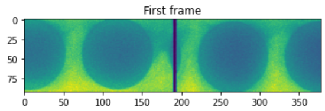

# nd2handling
This package is useful when you are handling NIS-Elements image files with the extension ".nd2". nd2-files are basically [TIF-files](https://en.wikipedia.org/wiki/TIFF) with added metadata. However, while TIF-files are very easy to load into python, nd2-files are notoriously difficult. There are currently two public libraries that can load nd2-files into python. These are [nd2reader](https://pypi.org/project/nd2reader/) and [pims-nd2](https://pypi.org/project/pims-nd2/). This package utilizes both exentions as you need both to read **all** available metadata. This package makes the whole process smoother and easier if you are working with a lot of image files.

You can use this package to load nd2 files and their metadata. You can also use it to gather all metadata of a folder tree into an excel sheet. If any of the metadata you need is not being gathered, please tell me and I can make sure it is added.


## Dependencies
**In order for this script to work, you need to install the following modules:**

- pip install nd2reader >= 3.3.0, < 4
- pip install pims-nd2 >= 1.1, < 2

**You also need the more general modules pandas and numpy:**
- pip install pandas >= 1.3.3,   < 2
- pip install numpy >= 1.19,  < 2         

## Install the package
Currently the package can be found on [test.pypi.org](https://test.pypi.org/project/nd2handling/0.0.1/). Install it on your anaconda prompt by:
```shell 
pip install -i https://test.pypi.org/simple/ nd2handling==0.0.1
```

## What metadata can we extract from nd2-files?
- frame rate
- image dimensions
- bit depth
- average exposure time
- x,y and z coordinates of the ROI (for every single frame, useful if the ROI is moving during recording)
- light source intensity (if connected to NIS-Elements)
- Number in frames (and easily calculated to duration seconds with the frame rate)
- The timestamp (and date) of the image (and each frame if a movie). This is especially useful if one manipulates the sample with e.g. pressure and know the timestamp for the pressure manipulations.
- Magnification (e.g. 100x, 5x etc...)

I also used this script to extract information I saved in the filename, such as pressure level (that is not saved in NIS-Elements)

## Extracting basic metadata with nd2read and pims-nd2

### Using nd2reader
For a full tutorial, see [here](https://rbnvrw.github.io/nd2reader/tutorial.html#nd2-metadata)
```python
import os
file_path = r'E:\DNA waves project\Polarisation exp\2021-06-03_lambda_400nguL_1_200\100mbar\100xOil_100mbar_pol-none_mid_solis100_019.nd2'

from nd2reader import ND2Reader

with ND2Reader(file_path) as img:
    print('All metadata:')
    frame_rate = img.frame_rate
    time_steps = img.get_timesteps()
    print(img.get_timesteps())
    print(img.pixel_type)
    print(img.events)
    exposure_times = img.parser._raw_metadata.camera_exposure_time
    avg_exposure_time = np.mean(exposure_times)
    acquisition_times = img.parser._raw_metadata.acquisition_times
    print("\n{" + "\n".join("{!r}: {!r},".format(k, v) for k, v in img.metadata.items() if (not k=='z_coordinates')) + "}") 
    print('\n')
    print(img.sizes)
```
### Using pims-nd2
```python
from pims import ND2_Reader #does not work for files with 3846 frames
file_path = r'E:\DNA waves project\Polarisation exp\2021-06-16_lambda_400nguL_1_200_optosplit\100xOil_500mbar_C2017_sola100_010.nd2'
try:
    with ND2_Reader(file_path) as frames:
    #frames[82]  # display frame 82
        print('All metadata:')
        print("{" + "\n".join("{!r}: {!r},".format(k, v) for k, v in frames.metadata.items()) + "}")
        print('\n\nSingle frame Metadata:')
        print("{" + "\n".join("{!r}: {!r},".format(k, v) for k, v in frames[5].metadata.items()) + "}")

        # for f in frames:
        #     print(f.metadata['t_ms'])

        frames.close()
except:
    print('Caught an error')
finally:
    print('')
```

## Using nd2_handling

### List all nd2 files in a folder tree to an excel spreadsheet
During my PhD, I used this extensively, for every experiment. This is a very fast method to get an overview of all the metadata of all the files for a single experiment. The output is an excel document, listing all files with their metadata (e.g. frame rate, dureation in second and frames, ROI dimensions etc...). I found it immensely useful when needing to select files for publications when I made so many duplicates in different ROI sizes, durations, frame rates and so on.

```python
import import nd2handling.nd2handling as nd2

#Set the path of the experiment directory
dir_path = r'E:\DNA waves project\Higher viscosity waves\2021-10-25 40% sucrose 50 nguL'
nd2.nd2_file_infos_to_spreadsheet(dir_path, read_time_steps=False, read_xy_pos=False, read_file_name_info=True)
```

### Loop the above script for many directories
```python
import import nd2handling.nd2handling as nd2

#Set the path of the main directory
dir_main = r'E:\DNA waves project\Polarisation exp' #Change to your own directory containing subdirectories with .nd2-files.

nd2.get_nd2_lists_for_all_subfolders(dir_main, read_file_name_info=True)
```

For the output, see the file "example_generated_spreadsheet.xlsx" in the repository.

### Loading a single nd2 file with its metadata
```python
import import nd2handling.nd2handling as nd2
import matplotlib.pyplot as plt

#Set the path of the nd2-file:
nd2_file_path = r'E:\DNA waves project\Polarisation exp\2021-06-16_lambda_400nguL_1_200_optosplit\100xOil_500mbar_C2017_sola100_010.nd2'

#Load the nd2 file
v = nd2.Video(nd2_file_path, read_img_directly=True, frame_range = [0,0])

#Print all the information containing all the attributes of the object
print(v)

#Display the first frame of the image stack
plt.imshow(v.img[0])
plt.title('First frame')
plt.show()

#Access the attributes:
print('frame_rate = ', v.frame_rate)
print('height = ', v.height)
```

Output:
```
Reading file 100xOil_500mbar_C2017_sola100_010.nd2 in folder 2021-06-16_lambda_400nguL_1_200_optosplit
	Read 4935 uint16 frame(s) from 100xOil_500mbar_C2017_sola100_010.nd2 in 8.90 seconds
Video(4935, 92, 378):
	- file_path: E:\DNA waves project\Polarisation exp\2021-06-16_lambda_400nguL_1_200_optosplit\100xOil_500mbar_C2017_sola100_010.nd2
	- dir_file: E:\DNA waves project\Polarisation exp\2021-06-16_lambda_400nguL_1_200_optosplit
	- file_name: 100xOil_500mbar_C2017_sola100_010.nd2
	- file_name0: 100xOil_500mbar_C2017_sola100_010
	- str_contains_img: (4935, 92, 378)
	- parent_folder: 2021-06-16_lambda_400nguL_1_200_optosplit
	- avg_exposure_time_ms: 4.32
	- mag: 100x
	- p: 500
	- file_nbr: 010
	- light_source: sola
	- light_source_intensity: 100.0
	- frame_rate: 164.8
	- time_start: 2021-06-16 15:49:58.736005
	- bit_depth: 16
	- width: 378
	- height: 92
	- n_frames: 4935
	- shape: (4935, 92, 378)
	- time_s: 30.0
	- x_um_frame0: 1304.927978515625
	- y_um_frame0: -4146.3232421875
	- scale_pix_per_um: 6.25
```

```python
frame_rate =  164.8
height =  92
```

### Loading only the metadata of an nd2 file 
This is useful when the files are large and takes long time to load. Only loading the metadata goes in a few seconds.
```python
import import nd2handling.nd2handling as nd2

#Set the path of the nd2-file:
nd2_file_path = r'E:\DNA waves project\Polarisation exp\2021-06-16_lambda_400nguL_1_200_optosplit\100xOil_500mbar_C2017_sola100_010.nd2'

#Load the nd2 file without its metadata
v = nd2.Video(nd2_file_path, read_img_directly=False)
print(v)

#Access the attributes:
print('\nframe_rate = ', v.frame_rate)
print('height = ', v.height)
```
Output:
```
Video(empty):
	- file_path: E:\DNA waves project\Polarisation exp\2021-06-16_lambda_400nguL_1_200_optosplit\100xOil_500mbar_C2017_sola100_010.nd2
	- dir_file: E:\DNA waves project\Polarisation exp\2021-06-16_lambda_400nguL_1_200_optosplit
	- file_name: 100xOil_500mbar_C2017_sola100_010.nd2
	- file_name0: 100xOil_500mbar_C2017_sola100_010
	- str_contains_img: (empty)
	- parent_folder: 2021-06-16_lambda_400nguL_1_200_optosplit
	- avg_exposure_time_ms: 4.32
	- mag: 100x
	- p: 500
	- file_nbr: 010
	- light_source: sola
	- light_source_intensity: 100.0
	- frame_rate: 164.8
	- time_start: 2021-06-16 15:49:58.736005
	- bit_depth: 16
	- width: 378
	- height: 92
	- n_frames: 4935
	- shape: (4935, 92, 378)
	- time_s: 30.0
	- x_um_frame0: 1304.927978515625
	- y_um_frame0: -4146.3232421875
	- scale_pix_per_um: 6.25

frame_rate =  164.8
height =  92
```